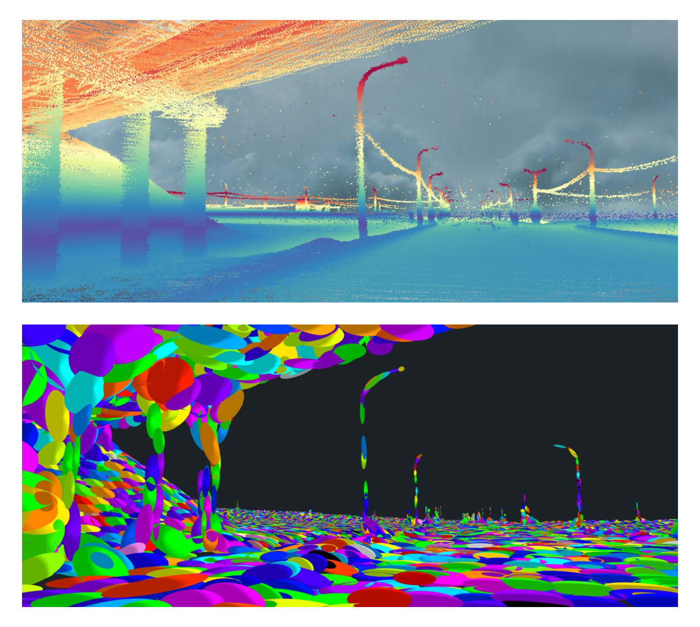
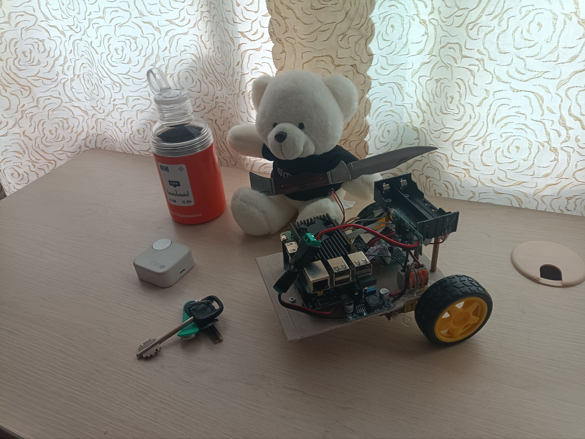
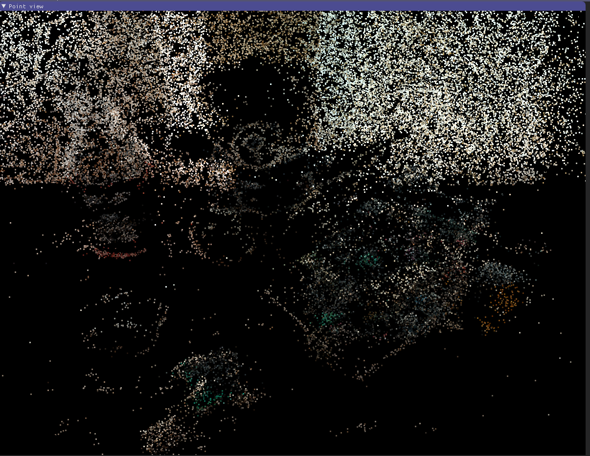
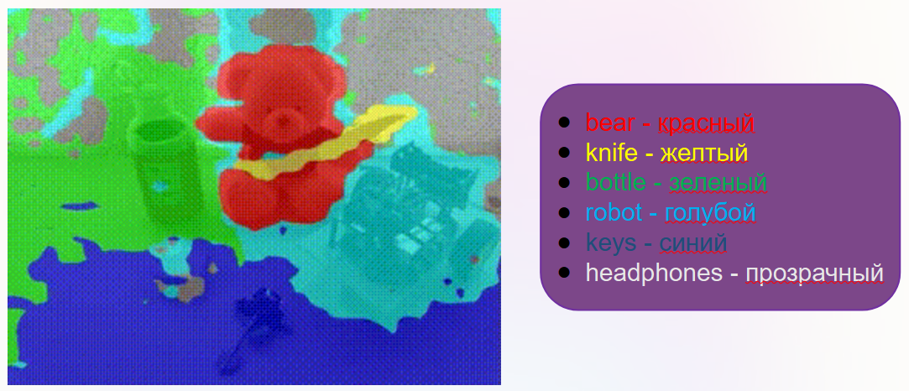
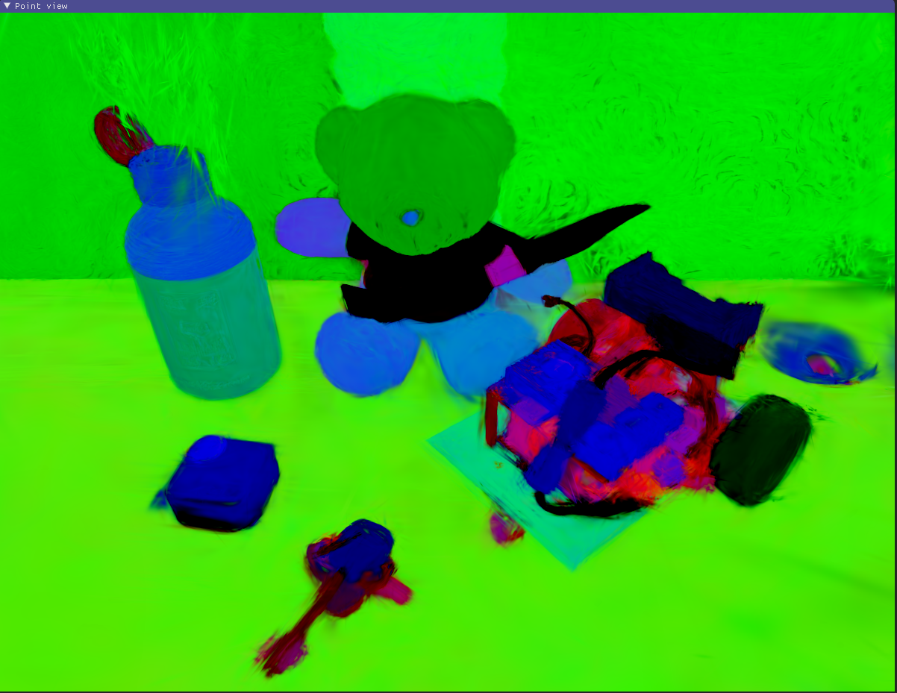
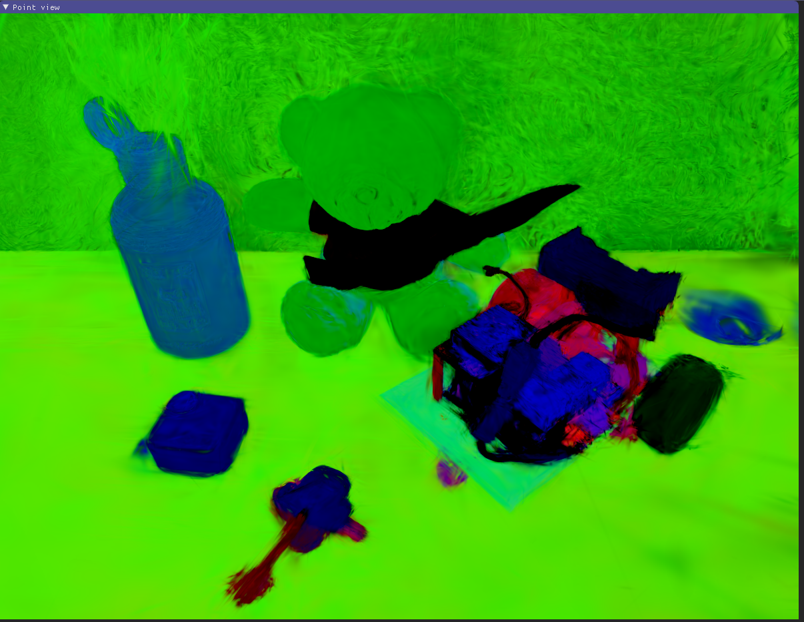
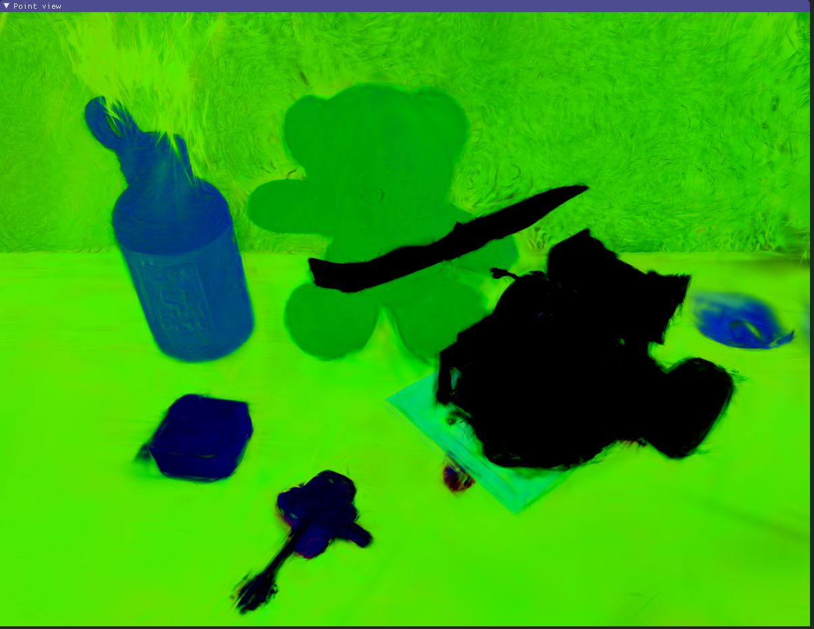
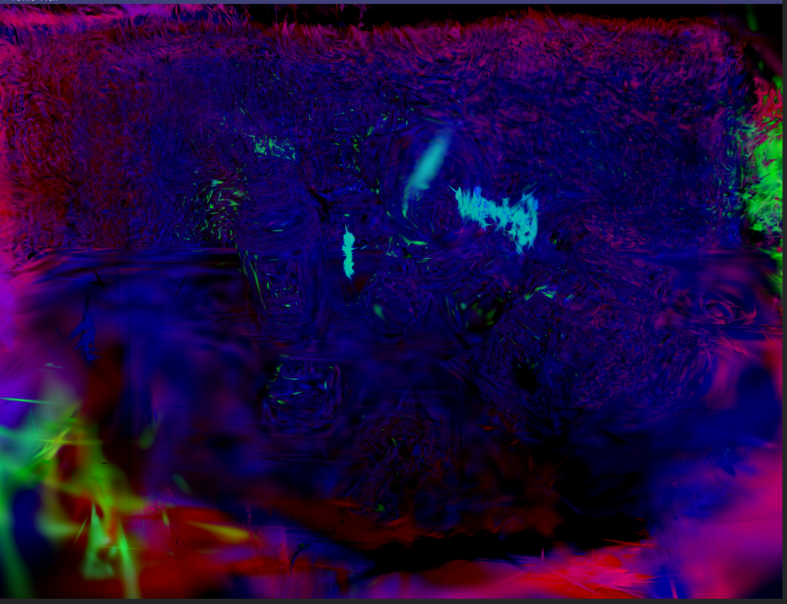
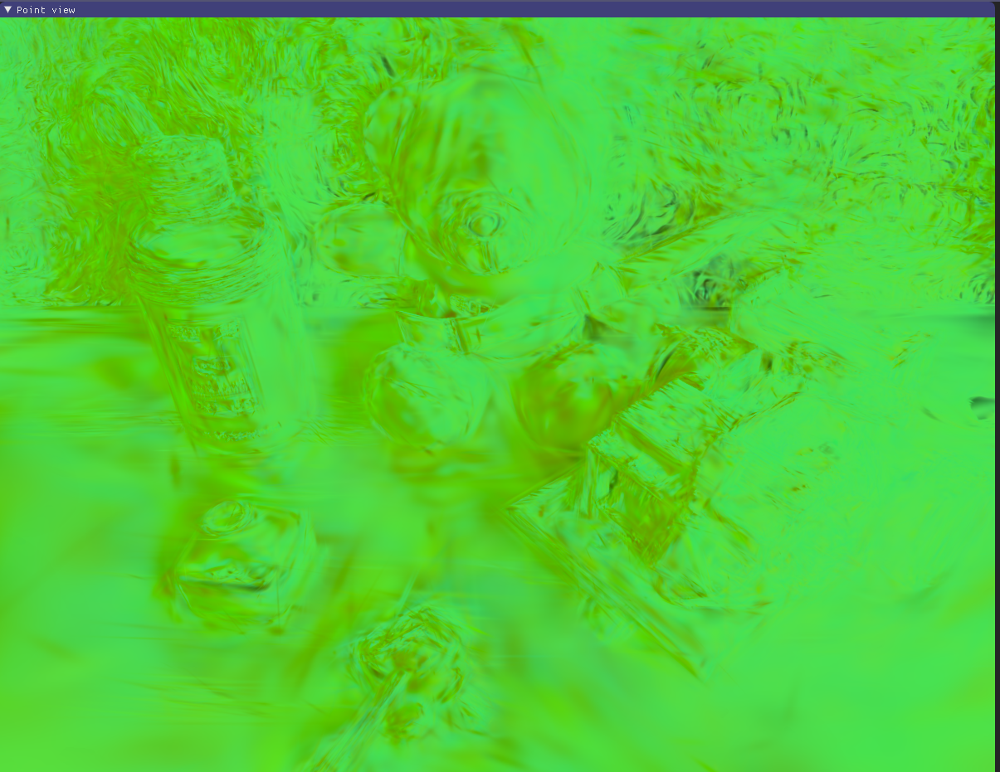
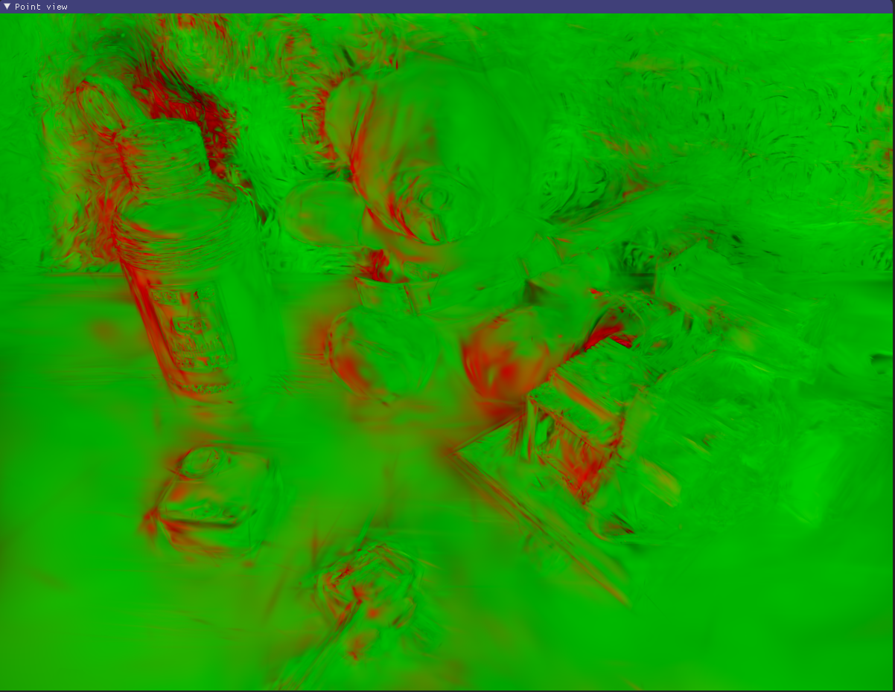

# semantic-3d-gaussian-splatting
> Semantic 3D Gaussian Splatting with Talk2DINO embeddings on top of LangSplat and 3D Gaussian Splatting.

---

## 💡 Идея сплаттинга

В классическом нейрографическом подходе сцена представляется непрерывной функцией плотности и цвета, которую нужно интегрировать вдоль лучей камеры — это красиво теоретически, но довольно тяжёлый по вычислениям процесс. **Gaussian Splatting** предлагает более «графический» взгляд: мы описываем сцenu не уравнением, а набором дискретных примитивов — обычно это 3D-гауссианы с положением, формой, цветом и прозрачностью. При рендеринге эти гауссианы проецируются на плоскость изображения и «размазываются» (splat), накапливая вклад в каждый пиксель. За счёт этого удаётся добиться очень высокой скорости рендеринга при конкурентном качестве, что особенно ценно для интерактивных приложений и робототехники.

Дополнительно, splatting даёт удобную точку входа для **семантики**. Вместо того чтобы хранить только цвет и плотность, к каждому гауссиану можно приписать ещё и семантический вектор (эмбеддинг) из внешней модели — CLIP, Talk2DINO и т.п. Тогда сцена становится не просто геометрически и визуально согласованной, но и «понимающей» текстовые запросы: можно находить объекты по описанию, подсвечивать области с нужными свойствами, строить семантические карты. Такое сочетание непрерывного 3D-представления с дискретным набором богатых по содержанию примитивов делает Gaussian Splatting удобной базой для следующих уровней интеллекта в 3D-мире.

---

## 🧠 Идея проекта

Этот репозиторий реализует **семантический 3D Gaussian Splatting** поверх существующих работ:

- [3D Gaussian Splatting] — быстрый и фотореалистичный метод реконструкции 3D-сцены в виде набора гауссиан в 3D-пространстве;
- [LangSplat] — добавляет к 3DGS **языковые (семантические) признаки**, позволяя делать open-vocabulary запросы к сцене;
- **наш вклад** — мы заменяем стадию получения эмбеддингов изображений  
  с классического пайплайна (SAM + CLIP)  
  на **Talk2DINO** и интегрируем эти эмбеддинги в существующий LangSplat-пайплайн.

В результате получается сцена, где каждый Gaussian несёт не только цвет и плотность, но и **семантический вектор**, с которым можно работать через текстовые запросы.

---

## 📚 Теория

### 1. 3D Gaussian Splatting

**3D Gaussian Splatting** — это представление сцены как набора **анизотропных 3D-гауссиан**:

- каждый гауссиан имеет:
  - центр в 3D;
  - ковариационную матрицу (форма/размер);
  - цвет;
  - прозрачность/плотность;
- рендеринг делается как **проекция гауссиан на изображение** и их последующее смешивание (splatting);
- параметры гауссиан оптимизируются по набору изображений сцены (как в NeRF, но с другими примитивами).

Главные плюсы:

- очень **быстрый рендеринг** (подходит для интерактива);
- хорошее качество;
- удобная дифференцируемость (можно дообучать/достраивать сцену).

---

### 2. Семантические поля и LangSplat

Классический NeRF/3DGS описывает только **геометрию и внешний вид**.  
LangSplat, LERF и похожие работы предлагают:

- для каждого пикселя/луча дополнительно иметь **языковые признаки**;
- эти признаки получаются из **внешней модели** (CLIP, BLIP, LLM, Detic и т.п.);
- затем они **проецируются в 3D**, и к каждому гауссиану приписывается семантический вектор.

Что это даёт:

- **open-vocabulary запросы**:
  - «найди в сцене *ramen*»,
  - «подсвети все *cups*»,
  - «покажи регион, похожий на *plant*»;
- возможность вычислять **косинусное сходство** между текстовым запросом и 3D-признаками.

---

### 3. Почему Talk2DINO вместо SAM

В оригинальных пайплайнах нередко используется что-то вроде:

1. Семантическая/инстансная сегментация (SAM / Detic / др.);
2. Для каждой области — получение эмбеддингов (CLIP, LLM-based и т.п.);
3. Эти эмбеддинги «раздаются» пикселям внутри сегмента.

У такого подхода есть минусы:

- зависимость от качества сегментации;
- чувствительность к настройкам масок/порогов;
- не всегда стабильная работа в open-vocabulary сценариях «из коробки».

**Talk2DINO** — это модель, заточенная под:

- **open-vocabulary детекцию и семантику**;
- качественные эмбеддинги для text–image matching;
- более прямую работу с текстовыми запросами без жёсткой привязки к фиксированному набору классов.

В этом репозитории мы:

- **полностью заменяем** блок получения эмбеддингов:
  - не используем SAM в качестве основного источника признаков;
  - вместо этого прогоняем изображения через **Talk2DINO**;
- полученные эмбеддинги:
  - сжимаются автоэнкодером,
  - проецируются в 3D,
  - становятся **семантическим полем гауссиан**.

Таким образом, геометрия по-прежнему приходит из **3DGS**,  
а **семантика** — из цепочки **Talk2DINO → автоэнкодер → LangSplat**.

---

## 🧱 Архитектура пайплайна

В общих чертах пайплайн выглядит так:

1. **Подготовка данных**  
   - изображения + камера-позы (COLMAP или GT-позы);  
   - структура как в `LangSplat/lerf_ovs/<scene_name>/...`.

2. **Обучение 3D Gaussian Splatting**  
   - запускается отдельный проект `gaussian-splatting`;
   - результат — чекпоинт с 3D-гауссианами (геометрия + цвет).

3. **Извлечение эмбеддингов Talk2DINO** (наша модификация)  
   - каждое изображение прогоняется через Talk2DINO;
   - сохраняются семантические карты/признаки.

4. **Обучение автоэнкодера семантических карт**  
   - вход: Talk2DINO-признаки;
   - выход: компактные латентные векторы;
   - цель: сжать семантику до разумной размерности.

5. **Проекция признаков в 3D (LangSplat-style)**  
   - для каждого луча/пикселя известны:
     - геометрия (3D-гауссианы),
     - семантика (латенты Talk2DINO);
   - обучаем 3D-сцену так, чтобы 3DGS воспроизводил не только RGB, но и семантические признаки.

6. **Обучение Semantic Gaussian Splatting**  
   - стартуем из чекпоинта 3DGS;
   - добавляем к каждому гауссиану семантический вектор;
   - доводим сцену, минимизируя комбинированную ошибку (изображения + семантика).

7. **Запросы и визуализация**  
   - текстовый запрос → эмбеддинг (через ту же или совместимую модель);
   - считаем косинусное сходство с 3D-полем;
   - визуализируем релевантные регионы (heatmap/маски/подсветка гауссиан).

---

## 🗣️ Talk2DINO

CLIP хорошо понимает связь «картинка ↔ текст», но плохо локализует объекты по пикселям.  
DINOv2, наоборот, отлично ловит тонкую пространственную структуру, но вообще не привязан к языку.

**Talk2DINO** аккуратно склеивает эти два мира:

- берёт текстовые эмбеддинги CLIP и через обучаемое нелинейное отображение (warping function) переводит их в пространство patch-фич DINOv2;
- в результате каждый патч изображения можно напрямую сравнивать с текстовым запросом;
- сами бэкбоны CLIP и DINOv2 не дообучаются — учится только небольшой «мост» между ними.

За счёт использования self-attention карт DINOv2 Talk2DINO умеет довольно точно выделять релевантные области и очищать фон, что критично для **open-vocabulary segmentation**: можно подать произвольный текстовый список категорий и получить плотную карту похожести «текст ↔ каждый патч изображения». На практике это даёт более естественные и менее шумные маски, чем у чистых CLIP-подходов, и state-of-the-art результаты на ряде OVS-бенчмарков.

Готовые модели доступны в открытом доступе и позволяют просто вызвать условные `encode_image` / `encode_text` и получать совместимое пространство признаков, что делает Talk2DINO удобным источником **семантических эмбеддингов** для последующей 3D-интеграции, как в нашем splatting-пайплайне.

---

## 🎯 Наша работа

В этом разделе приведены иллюстрации ключевых стадий пайплайна: от исходных данных до семантических признаков, полученных с помощью Talk2DINO, а также их дальнейшего сжатия и проекции.

### Входные данные сцены

На рис. 1 показан один из кадров исходного датасета, используемый для обучения 3D Gaussian Splatting.  
Этот кадр отражает типичную сложность сцены: наличие нескольких объектов, фон, частичные перекрытия и разнообразное освещение.

  
*Рис. 1. Пример входного изображения из датасета.*

Для наглядности на рис. 2 представлено восстановленное облако точек, полученное на стадии Structure-from-Motion (например, с помощью COLMAP) или из промежуточного результата Gaussian Splatting. Облако точек демонстрирует геометрию сцены, на основе которой затем оптимизируются параметры 3D-гауссиан.

  
*Рис. 2. Облако точек сцены, использующееся для инициализации 3D-представления.*

---

### Результаты работы Talk2DINO

Следующий шаг пайплайна — извлечение **семантических эмбеддингов** с помощью модели Talk2DINO. На рис. 3 слева показано исходное изображение, по центру — тепловая карта отклика Talk2DINO на заданный текстовый запрос (например, *«ramen»*), справа — визуализация маски или выделенной области с максимальным откликом.

  
*Рис. 3. Пример работы Talk2DINO: исходный кадр, тепловая карта сходства «текст–изображение» и итоговая маска/подсветка целевого объекта.*

Такие карты сходства вычисляются для каждого изображения датасета и далее используются как плотные семантические признаки, которые будут проецированы в 3D-пространство и привязаны к гауссианам сцены.

---

### Влияние уровня признаков (feature level = 1, 2, 3)

На рис. 4 показаны результаты использования разных уровней признаков (**feature level = 1, 2, 3**) в LangSplat-подобной части пайплайна. Каждый уровень соответствует различному масштабу и степени абстракции признаков: от более локальных и детализированных к более глобальным и устойчивым.

  
*Рис. 4a. Визуализация сцены с использованием признаков feature level = 1 (более локальные детали).*

  
*Рис. 4b. Визуализация сцены с использованием признаков feature level = 2 (баланс локальной и глобальной семантики).*

  
*Рис. 4c. Визуализация сцены с использованием признаков feature level = 3 (более глобальная семантика, сглаживание мелких деталей).*

Сравнение этих визуализаций позволяет оценить, как выбор уровня признаков влияет на качество локализации объектов, устойчивость к шуму и обобщающую способность семантического поля в 3D.

---

### Проекция эмбеддингов с помощью PCA

Поскольку Talk2DINO и последующий автоэнкодер работают в высокоразмерных пространствах, для интерпретации признаков удобно использовать **проекцию эмбеддингов с помощью PCA**. Мы понижаем размерность до первых трёх главных компонент и визуализируем их в виде отдельных карт.

На рис. 5 показаны результаты такой проекции: каждая картинка соответствует одной из трёх первых главных компонент, полученных из семантических эмбеддингов. Яркость/цвет пикселей отражают значение компоненты в данной точке изображения.

  
*Рис. 5a. Визуализация первой главной компоненты PCA для семантических эмбеддингов.*

  
*Рис. 5b. Визуализация второй главной компоненты PCA.*

  
*Рис. 5c. Визуализация третьей главной компоненты PCA.*

Такая проекция позволяет:

- обнаружить кластеры в пространстве признаков;
- наглядно увидеть, как разные семантические регионы изображения разводятся в пространстве признаков;
- подобрать более информативные комбинации компонент для последующей визуализации и анализа 3D-семантики.

В дальнейшем эти пониженноразмерные представления могут использоваться как вспомогательный инструмент для отладки и qualitative-анализа качества семантических полей, привязанных к гауссианам в 3D.

---

## 🔗 Ссылки

- [3D Gaussian Splatting (GraphDeco-Inria)](https://github.com/graphdeco-inria/gaussian-splatting)
- [LangSplat](https://github.com/minghanqin/LangSplat)
- [Talk2DINO](https://github.com/lorebianchi98/Talk2DINO)

---
