# Talking to DINO: Bridging Self-Supervised Vision Backbones with Language for Open-Vocabulary Segmentation
<span style="font-size: xx-large;">[Project page](https://lorebianchi98.github.io/Talk2DINO/) | [](http://arxiv.org/abs/2411.19331)

<div align="center">
<figure>
  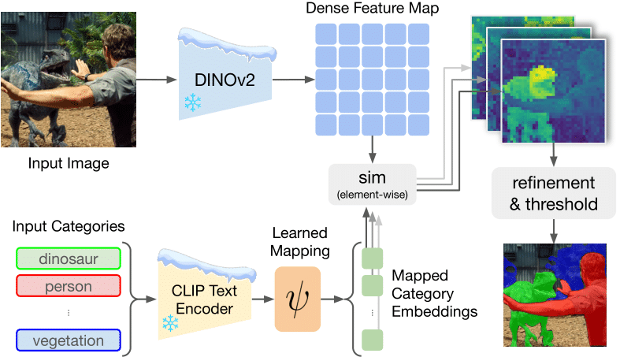
</figure>
</div>

Talk2DINO is an open-vocabulary segmentation architecture that combines the localized and semantically rich patch-level features of DINOv2 with the multimodal understanding capabilities of CLIP. This is achieved by learning a projection from the CLIP text encoder to the embedding space of DINOv2 using only image-caption pairs and exploiting the self-attention properties of DINOv2 to understand which part of the image has to be aligned to the corresponding caption.

## Results

| **Image** | **Ground Truth** | **FreeDA** | **ProxyCLIP** | **CLIP-DINOiser** | **Ours (Talk2DINO)** |
|-----------|------------------|------------|---------------|-------------------|------------------|
|  | 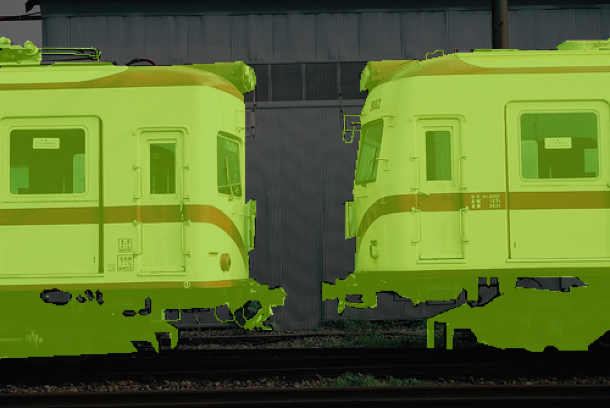 | 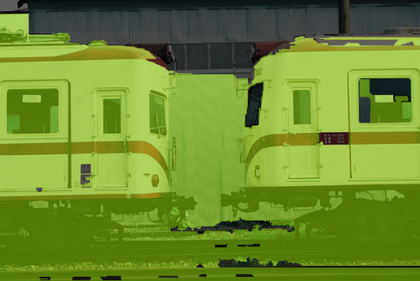 | 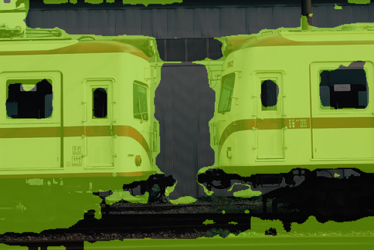 | 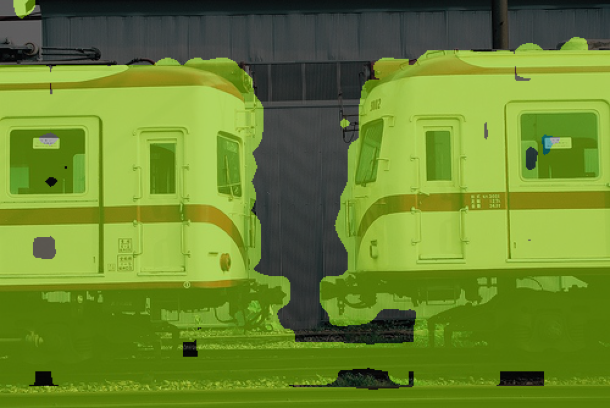 | 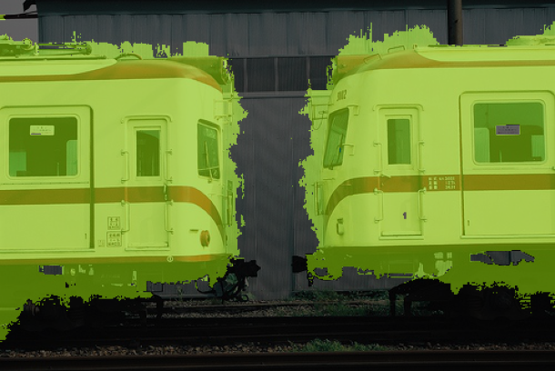 |
|  | 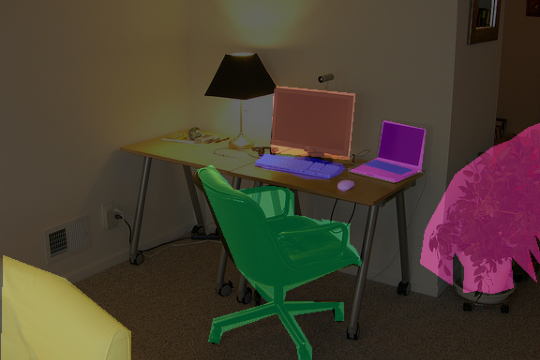 | 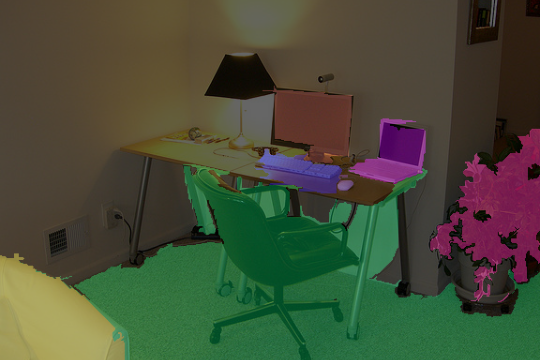 | 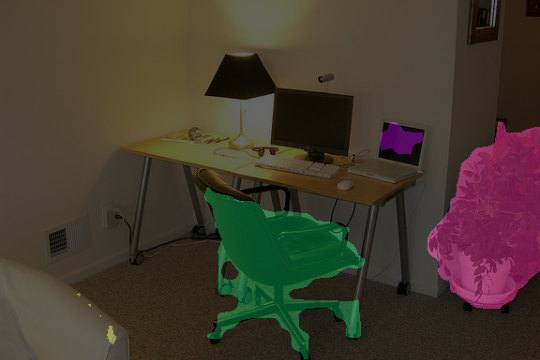 | 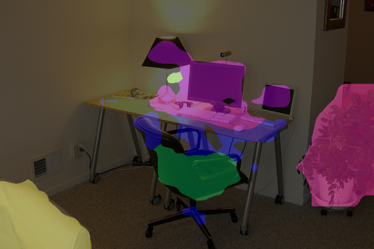 | 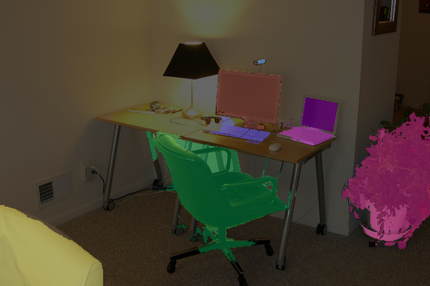 |
| 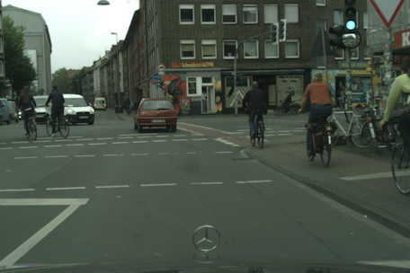 | 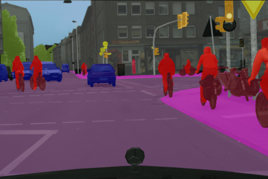 | 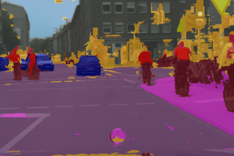 | 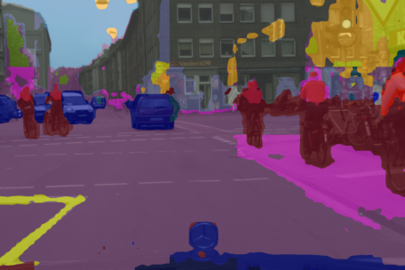 | 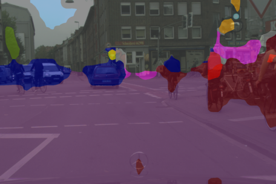 | 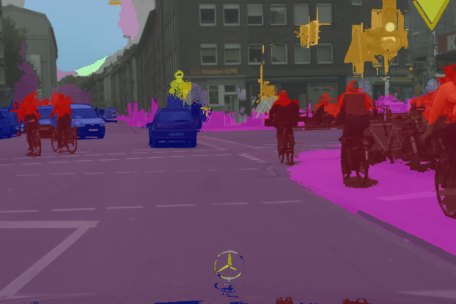 |
|  |  |  |  |  |  |


## Installation
```bash
conda create --name talk2dino python=3.9
conda activate talk2dino
pip install torch==1.13.1+cu117 torchvision==0.14.1+cu117 torchaudio==0.13.1 --extra-index-url https://download.pytorch.org/whl/cu117
pip install -r requirements.txt
pip install -U openmim
mim install mmengine
mim install "mmcv-full==1.6.2"
mim install "mmsegmentation==0.27.0"
```

## Mapping CLIP Text Embeddings to DINOv2 space with Talk2DINO
We can use Talk2DINO to map CLIP text embeddings into the DINOv2 patch embedding space.
```python
import clip
from src.model import ProjectionLayer
import torch
import os

# Device setup
device = 'cuda' if torch.cuda.is_available() else 'cpu'

# Configuration and weights
proj_name = 'vitb_mlp_infonce'
config_path = os.path.join("configs", f"{proj_name}.yaml")
weights_path = os.path.join("weights", f"{proj_name}.pth")

# Load Talk2DINO projection layer
talk2dino = ProjectionLayer.from_config(config_path)
talk2dino.load_state_dict(torch.load(weights_path, map_location=device))
talk2dino.to(device)

# Load CLIP model
clip_model, clip_preprocess = clip.load("ViT-B/16", device=device, jit=False)
tokenizer = clip.tokenize

# Example: Tokenize and project text features
texts = ["a cat"]
text_tokens = tokenizer(texts).to(device)
text_features = clip_model.encode_text(text_tokens)
projected_text_features = talk2dino.project_clip_txt(text_features)
```


## Feature Extraction
To speed up training, we use pre-extracted features. Follow these steps:

1. Download the 2014 images and annotations from the [COCO website](https://cocodataset.org/#download).
2. Run the following commands to extract features:
    ```bash
    mkdir ../coco2014_b14
    python dino_extraction_v2.py --ann_path ../coco/captions_val2014.json --out_path ../coco2014_b14/val.pth --model dinov2_vitb14_reg --resize_dim 448 --crop_dim 448 --extract_avg_self_attn --extract_disentangled_self_attn
    python dino_extraction_v2.py --ann_path ../coco/captions_train2014.json --out_path ../coco2014_b14/train.pth --model dinov2_vitb14_reg --resize_dim 448 --crop_dim 448 --extract_avg_self_attn --extract_disentangled_self_attn
    python text_features_extraction.py --ann_path ../coco2014_b14/train.pth
    python text_features_extraction.py --ann_path ../coco2014_b14/val.pth
    ```

## Training

To train the model, use the following command (this example runs training for the ViT-Base configuration):

```bash
python train.py --model configs/vitb_mlp_infonce.yaml --train_dataset ../coco2014_b14/train.pth --val_dataset ../coco2014_b14/val.pth
```
## Evaluation

This section is adapted from [GroupViT](https://github.com/NVlabs/GroupViT), [TCL](https://github.com/khanrc/tcl), and [FreeDA](https://github.com/aimagelab/freeda). The segmentation datasets should be organized as follows:

```shell
data
├── cityscapes
│   ├── leftImg8bit
│   │   ├── train
│   │   ├── val
│   ├── gtFine
│   │   ├── train
│   │   ├── val
├── VOCdevkit
│   ├── VOC2012
│   │   ├── JPEGImages
│   │   ├── SegmentationClass
│   │   ├── ImageSets
│   │   │   ├── Segmentation
│   ├── VOC2010
│   │   ├── JPEGImages
│   │   ├── SegmentationClassContext
│   │   ├── ImageSets
│   │   │   ├── SegmentationContext
│   │   │   │   ├── train.txt
│   │   │   │   ├── val.txt
│   │   ├── trainval_merged.json
│   ├── VOCaug
│   │   ├── dataset
│   │   │   ├── cls
├── ade
│   ├── ADEChallengeData2016
│   │   ├── annotations
│   │   │   ├── training
│   │   │   ├── validation
│   │   ├── images
│   │   │   ├── training
│   │   │   ├── validation
├── coco_stuff164k
│   ├── images
│   │   ├── train2017
│   │   ├── val2017
│   ├── annotations
│   │   ├── train2017
│   │   ├── val2017
```

Please download and setup [PASCAL VOC](https://github.com/open-mmlab/mmsegmentation/blob/master/docs/en/dataset_prepare.md#pascal-voc)
, [PASCAL Context](https://github.com/open-mmlab/mmsegmentation/blob/master/docs/en/dataset_prepare.md#pascal-context), [COCO-Stuff164k](https://github.com/open-mmlab/mmsegmentation/blob/master/docs/en/dataset_prepare.md#coco-stuff-164k)
, [Cityscapes](https://github.com/open-mmlab/mmsegmentation/blob/master/docs/en/dataset_prepare.md#cityscapes), and [ADE20k](https://github.com/open-mmlab/mmsegmentation/blob/master/docs/en/dataset_prepare.md#ade20k) datasets
following [MMSegmentation data preparation document](https://github.com/open-mmlab/mmsegmentation/blob/master/docs/en/dataset_prepare.md).

COCO-Object dataset uses only object classes from COCO-Stuff164k dataset by collecting instance semgentation annotations. Run the following command to convert instance segmentation annotations to semantic segmentation annotations:
```bash
python convert_dataset/convert_coco.py data/coco_stuff164k/ -o data/coco_stuff164k/
```

To evaluate the model on open-vocabulary segmentation benchmarks, use the `src/open_vocabulary_segmentation/main.py` script. Select the appropriate configuration based on the model, benchmark, and PAMR settings. The available models are ``[vitb, vitl]``, while the available benchmarks are ``[ade, cityscapes, voc, voc_bg, context, context_bg, cityscapes, coco_object, stuff]``. Below we provide the list of evaluations to reproduce the results reported in the paper for the ViT-Base architecture:

```bash
# ADE20K
python -m torch.distributed.run src/open_vocabulary_segmentation/main.py --eval --eval_cfg src/open_vocabulary_segmentation/configs/ade/dinotext_ade_vitb_mlp_infonce.yml --eval_base src/open_vocabulary_segmentation/configs/ade/eval_ade_pamr.yml

# Cityscapes
python -m torch.distributed.run src/open_vocabulary_segmentation/main.py --eval --eval_cfg src/open_vocabulary_segmentation/configs/cityscapes/dinotext_cityscapes_vitb_mlp_infonce.yml --eval_base src/open_vocabulary_segmentation/configs/cityscapes/eval_cityscapes_pamr.yml

# Pascal VOC (without background)
python -m torch.distributed.run src/open_vocabulary_segmentation/main.py --eval --eval_cfg src/open_vocabulary_segmentation/configs/voc/dinotext_voc_vitb_mlp_infonce.yml --eval_base src/open_vocabulary_segmentation/configs/voc/eval_voc_pamr.yml

# Pascal VOC (with background)
python -m torch.distributed.run src/open_vocabulary_segmentation/main.py --eval --eval_cfg src/open_vocabulary_segmentation/configs/voc_bg/dinotext_voc_bg_vitb_mlp_infonce.yml --eval_base src/open_vocabulary_segmentation/configs/voc_bg/eval_voc_bg_pamr.yml

# Pascal Context (without background)
python -m torch.distributed.run src/open_vocabulary_segmentation/main.py --eval --eval_cfg src/open_vocabulary_segmentation/configs/context/dinotext_context_vitb_mlp_infonce.yml --eval_base src/open_vocabulary_segmentation/configs/context/eval_context_pamr.yml

# Pascal Context (with background)
python -m torch.distributed.run src/open_vocabulary_segmentation/main.py --eval --eval_cfg src/open_vocabulary_segmentation/configs/context_bg/dinotext_context_bg_vitb_mlp_infonce.yml --eval_base src/open_vocabulary_segmentation/configs/context_bg/eval_context_bg_pamr.yml

# COCOStuff
python -m torch.distributed.run src/open_vocabulary_segmentation/main.py --eval --eval_cfg src/open_vocabulary_segmentation/configs/stuff/dinotext_stuff_vitb_mlp_infonce.yml --eval_base src/open_vocabulary_segmentation/configs/stuff/eval_stuff_pamr.yml

# COCO Object
python -m torch.distributed.run src/open_vocabulary_segmentation/main.py --eval --eval_cfg src/open_vocabulary_segmentation/configs/coco_object/dinotext_coco_object_vitb_mlp_infonce.yml --eval_base src/open_vocabulary_segmentation/configs/coco_object/eval_coco_object_pamr.yml

```

Instead, the evaluations for the ViT-Large architecture are:

```bash
# ADE20K
python -m torch.distributed.run src/open_vocabulary_segmentation/main.py --eval --eval_cfg src/open_vocabulary_segmentation/configs/ade/dinotext_ade_vitl_mlp_infonce.yml --eval_base src/open_vocabulary_segmentation/configs/ade/eval_ade_pamr.yml

# Cityscapes
python -m torch.distributed.run src/open_vocabulary_segmentation/main.py --eval --eval_cfg src/open_vocabulary_segmentation/configs/cityscapes/dinotext_cityscapes_vitl_mlp_infonce.yml --eval_base src/open_vocabulary_segmentation/configs/cityscapes/eval_cityscapes_pamr.yml

# Pascal VOC (without background)
python -m torch.distributed.run src/open_vocabulary_segmentation/main.py --eval --eval_cfg src/open_vocabulary_segmentation/configs/voc/dinotext_voc_vitl_mlp_infonce.yml --eval_base src/open_vocabulary_segmentation/configs/voc/eval_voc_pamr.yml

# Pascal VOC (with background)
python -m torch.distributed.run src/open_vocabulary_segmentation/main.py --eval --eval_cfg src/open_vocabulary_segmentation/configs/voc_bg/dinotext_voc_bg_vitl_mlp_infonce.yml --eval_base src/open_vocabulary_segmentation/configs/voc_bg/eval_voc_bg_vitl_pamr.yml

# Pascal Context (without background)
python -m torch.distributed.run src/open_vocabulary_segmentation/main.py --eval --eval_cfg src/open_vocabulary_segmentation/configs/context/dinotext_context_vitl_mlp_infonce.yml --eval_base src/open_vocabulary_segmentation/configs/context/eval_context_pamr.yml

# Pascal Context (with background)
python -m torch.distributed.run src/open_vocabulary_segmentation/main.py --eval --eval_cfg src/open_vocabulary_segmentation/configs/context_bg/dinotext_context_bg_vitl_mlp_infonce.yml --eval_base src/open_vocabulary_segmentation/configs/context_bg/eval_context_bg_vitl_pamr.yml

# COCOStuff
python -m torch.distributed.run src/open_vocabulary_segmentation/main.py --eval --eval_cfg src/open_vocabulary_segmentation/configs/stuff/dinotext_stuff_vitl_mlp_infonce.yml --eval_base src/open_vocabulary_segmentation/configs/stuff/eval_stuff_pamr.yml

# COCO Object
python -m torch.distributed.run src/open_vocabulary_segmentation/main.py --eval --eval_cfg src/open_vocabulary_segmentation/configs/coco_object/dinotext_coco_object_vitl_mlp_infonce.yml --eval_base src/open_vocabulary_segmentation/configs/coco_object/eval_coco_object_vitl_pamr.yml
```

## Demo

In ``demo.py`` we provide a simple example on how to use Talk2DINO for inference on a given image with custom textual categories. Run

```bash
python demo.py --input custom_input_image --output custom_output_seg [--with_background] --textual_categories category_1,category_2,..
```

Example:
```bash
python demo.py --input assets/pikachu.png --output pikachu_seg.png --textual_categories pikachu,traffic_sign,forest,road
```

Result:
<div align="center">
<table><tr><td><figure>
  
</figure></td><td><figure>
  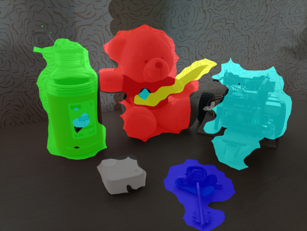
</figure></td></tr></table>
</div>


## Reference
If you found this code useful, please cite the following paper:
```
@misc{barsellotti2024talkingdinobridgingselfsupervised,
      title={Talking to DINO: Bridging Self-Supervised Vision Backbones with Language for Open-Vocabulary Segmentation}, 
      author={Luca Barsellotti and Lorenzo Bianchi and Nicola Messina and Fabio Carrara and Marcella Cornia and Lorenzo Baraldi and Fabrizio Falchi and Rita Cucchiara},
      year={2024},
      eprint={2411.19331},
      archivePrefix={arXiv},
      primaryClass={cs.CV},
      url={https://arxiv.org/abs/2411.19331}, 
}
```